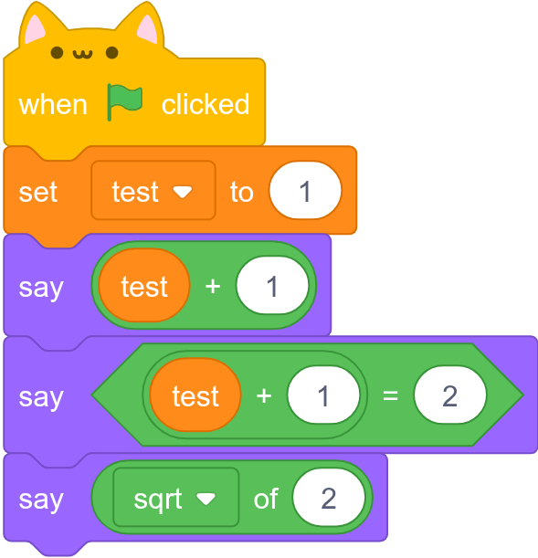
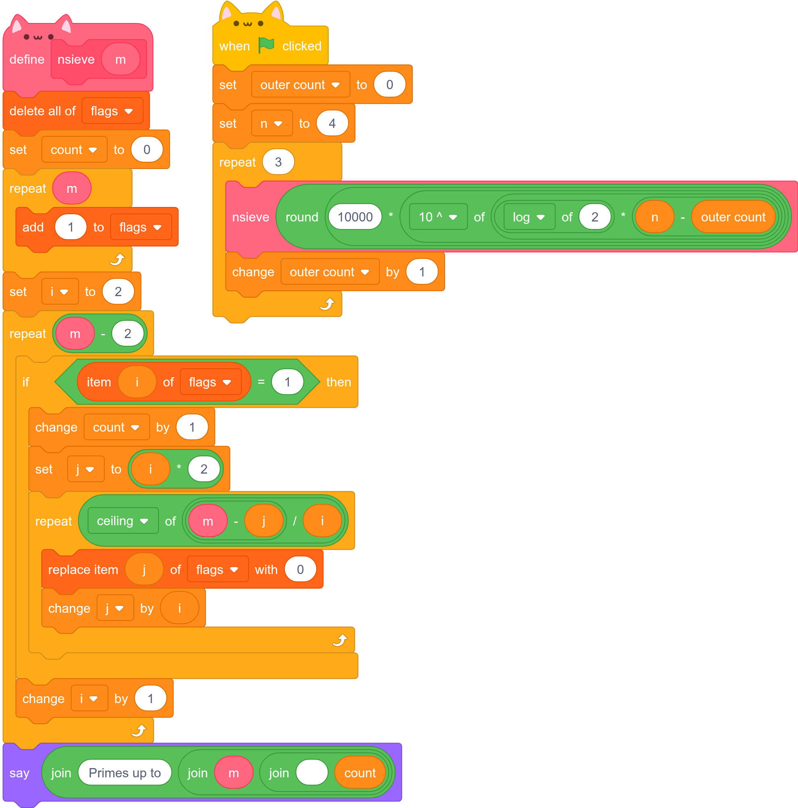

# Kat Compiler Collection


An (optionally headless) Scratch™ compiler and virtual machine written in Rust.

## Project State
It is currently capable of executing all Operators, `say` and `think` in Looks, Controls, and Variables blocks.

Here's a few examples of it running (rendered with cat ears):

```sh
$ kcc invest.sb3
2
true
1.4142135623730951
```


This example is not runnable yet.

## License
This program is free software. It comes without any warranty, to the extent permitted by applicable law. You can redistribute it and/or modify it under the terms of the [GNU General Public License, version 3](./LICENSE), or at your option (required if you want to intergrate it into a proprietary product), the [DORAEMON IS THE BEST ANIME PUBLIC LICENSE, version 1](./LICENSE_DORAEMON).

###### The Scratch name, Scratch logo, Scratch Day logo, Scratch Cat, and Gobo are Trademarks owned by the Scratch Team.